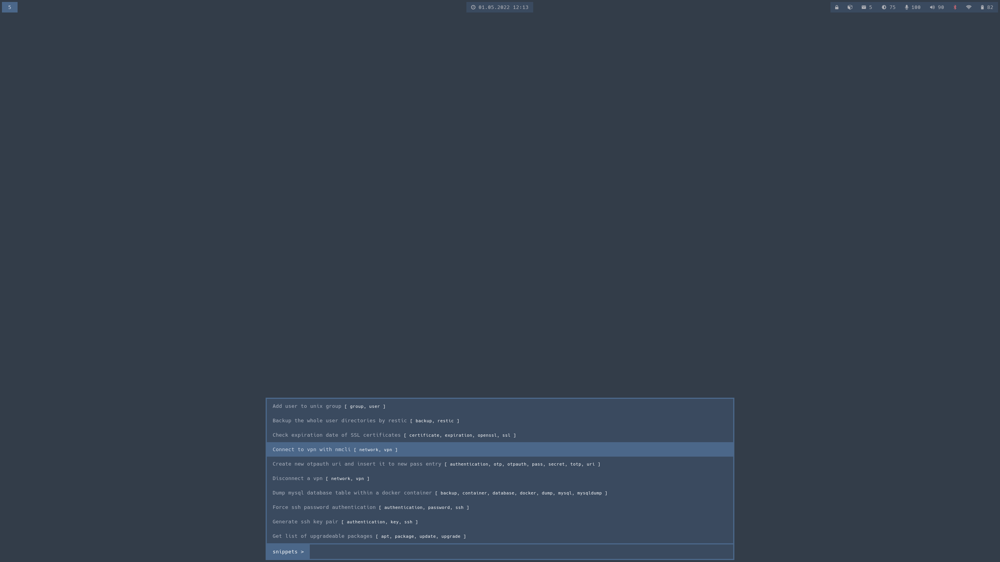

# rofi_pet_snippets

Rofi plugin to display, search and copy pet snippets to clipboard (wayland only).



# Dependencies

- [rofi](https://github.com/davatorium/rofi)
- [pet](https://github.com/knqyf263/pet)
- `wl-copy` (e.g. from the debian package `wl-clipboard`)
- `notify-send` (e.g. from debian package `libnotify4`
- `python3.9` or newer
- `requirements.txt` for runtime dependencies
- `requirements_dev.txt` for development dependencies
- `make` (optional)

# Getting Started

For a quick run or test of the rofi script.

```bash
make run
```

To install the rofi script.

```bash
make install
```

and run the rofi script in your window manager or wherever like this.

```bash
rofi -show snippets -modi "snippets:rofi_pet_snippets.py"
```
